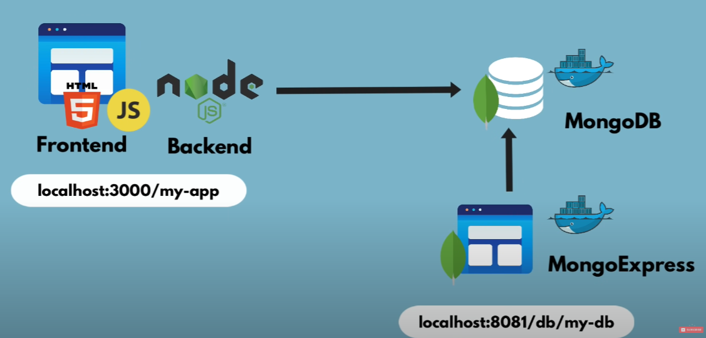

# Simple User-Profile app - developing with Docker

This demo app showcases a simple user profile app set up using the following components:
- `index.html` with pure JavaScript and CSS styles
- Node.js backend with the Express module
- MongoDB for data storage

All components are docker-based

## With Docker

### To start the application

**Step 1: Create docker network**

    docker network create mongo-network 

**step 2: start mongodb** 

    docker run -d -p 27017:27017 -e MONGO_INITDB_ROOT_USERNAME=admin -e MONGO_INITDB_ROOT_PASSWORD=password --name mongodb --net mongo-network mongo    

**Step 3: start mongo-express**
    
    docker run -d -p 8081:8081 -e ME_CONFIG_MONGODB_ADMINUSERNAME=admin -e ME_CONFIG_MONGODB_ADMINPASSWORD=password --net mongo-network --name mongo-express -e ME_CONFIG_MONGODB_SERVER=mongodb mongo-express   

_NOTE: creating docker-network in optional. You can start both containers in a default network. In this case, just emit `--net` flag in `docker run` command_

**Step 4: open mongo-express from browser**

    http://localhost:8081

**Step 5: create `user-account` _db_ and `users` _collection_ in mongo-express**

**Step 6: Start your nodejs application locally - go to `app` directory of project**

    npm install 
    node server.js
    
**Step 7: Access you nodejs application UI from browser**

    http://localhost:3000

## With Docker Compose

### To start the application

**Step 1: start mongoDB and mongo-express**

    docker-compose -f docker-compose.yaml up
    
_You can access the mongo-express under localhost:8080 from your browser_
    
**Step 2: in mongo-express UI - create a new database "my-db"**

**Step 3: in mongo-express UI - create a new collection "users" in the database "my-db"**      
    
**Step 4: start node server**

    npm install
    node server.js
    
**Step 5: access the nodejs application from browser**

    http://localhost:3000

### To build a docker image from the application

    docker build -t my-app:1.0 .       
    
The dot "." at the end of the command denotes location of the Dockerfile.

## Project Overview

This project is associated with a YouTube video that provides a detailed walkthrough of the docker in general. You can watch the video [here](https://www.youtube.com/watch?v=3c-iBn73dDE&t=1926s). The coding for this project was carried out while following the instructions provided in the video.

## YouTube Video Link

[Watch the YouTube video](https://www.youtube.com/watch?v=3c-iBn73dDE&t=1926s)

## Youtube Author's GitHub Repository(Original)

The author of the YouTube video has provided a GitHub repository for the project. You can find it [here](https://gitlab.com/nanuchi/techworld-js-docker-demo-app/-/tree/master#demo-app-developing-with-docker).

